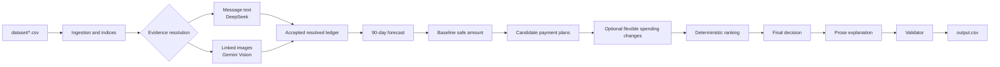

# Buy or Wait?

An AI-assisted, deterministic financial decision pipeline for HackerRank Orchestrate. For each request, it determines how much can safely be paid, whether the request is affordable now or later, and which supported payment plan best protects essential spending and the user's minimum balance.

The application is a terminal-run batch processor. It reads the supplied CSV dataset and writes a validated `output.csv` in the repository root.

## Project overview

The system reconstructs each user's financial position from:

- financial profiles and payment preferences;
- settled, pending, scheduled, failed, cancelled, linked, and unrealized events;
- exact dated exchange rates;
- seller payment options;
- relevant messages and linked images.

It evaluates a 90-day daily balance forecast. A recommendation is accepted only when the complete plan remains safe after protected spending and the user's minimum balance are reserved.

## User flow

For every request in `dataset/requests.csv`, the pipeline:

1. **Loads and normalizes data** into typed records with `Decimal` amounts, parsed dates, and lookup indices.
2. **Resolves supporting evidence**:
   - text extraction reviews plausible user messages in one batched call per user;
   - vision extraction reviews linked images for blank event amounts;
   - accepted changes must cite their source message or image label;
   - provider responses are cached and only metadata is written to call logs.
3. **Builds the financial forecast**:
   - applies future confirmed cash flows on settlement dates;
   - projects supported recurring obligations with a recent 27–31-day monthly cadence;
   - reserves the highest observed 30-day protected-category spending allowance;
   - uses exact direct exchange-rate lookups for foreign-currency events;
   - excludes unsupported credits, failed/cancelled rows, duplicate lifecycle debits, and unrealized/non-cash values.
4. **Calculates the baseline safe amount** before optional spending changes.
5. **Generates candidate plans** for full payment, partial payment, supplied installments, waiting, and rejection.
6. **Searches permitted spending changes** over eligible flexible events, considering at most three actions. Changes can improve plan safety but never increase the reported baseline safe amount.
7. **Ranks and selects** the safest eligible plan using deterministic rules, preserving supplied installment schedules verbatim.
8. **Generates a short explanation** from the already-final decision and deterministic supporting facts. The explanation layer returns prose only and cannot modify decision fields.
9. **Validates the typed rows and the serialized CSV** before completing the run.

### Pipeline flow



## Main features

- 90-day daily balance forecasting with protected spending allowances.
- Conservative recurrence detection based on same-user obligations and recent calendar cadence.
- Exact dated currency conversion with no inverse, nearest-date, or cross-rate fallback.
- Correct treatment of pending credits, pending debits, confirmed salary, transaction lifecycles, cancelled events, and unrealized investments.
- Image-backed blank-amount resolution with confidence and currency-conflict checks.
- Flexible expense actions: `stop:<event_id>` and `reduce_to:<event_id>:<amount>`.
- Payment-plan support for full payment, eligible partial payment, supplied installments, waiting, and rejection.
- Immutable final decision input to the explanation agent.
- SHA-256 provider caches and metadata-only provider call logs.
- Deterministic validation of bounds, enums, schedules, totals, deadlines, flexible-event references, request coverage, and CSV round-tripping.

## Output

The root-level `output.csv` contains one row for every request and these columns in order:

```text
request_id,amount_safe_to_pay,affordability_status,recommended_payment_method,payment_plan,earliest_date_for_full_payment,spending_changes_needed,decision_explanation
```

Allowed status values:

- `affordable_now`
- `affordable_with_plan`
- `affordable_later`
- `not_affordable`

Allowed payment methods:

- `full_payment`
- `partial_payment`
- `installments`
- `wait`
- `not_recommended`

Installment plans must match a supplied payment option exactly. Partial payment is emitted only when the request and profile allow it, the baseline safe amount is strictly between zero and the request amount, and the remainder can be completed by the requested deadline.

## Technical approach

### Data and forecasting

`code/ingestion.py` loads all participant-facing CSVs into dataclasses and builds indices by user, request, event, image, message, payment option, and exchange-rate key. Blank monetary fields remain missing values.

`code/currency.py` performs same-currency no-ops or exact direct conversion using the event settlement date. No live market or banking data is used.

`code/forecast.py` produces a daily `Decimal` balance curve. Stable obligations and regular payroll histories are projected only when recent settled dates support the monthly cadence. Essential variable spending is carried forward using the largest recent 30-day bucket for each protected category.

`code/decision_engine.py` is kept independent of CSV ingestion. It calculates safe payment capacity, earliest safe full-payment dates, candidate plans, deterministic ranking, and spending-change representations.

### Evidence and providers

`code/stage5.py` coordinates two narrowly scoped provider paths:

- **DeepSeek text extraction** processes message text for specific amendments only.
- **Gemini 2.5 Flash vision extraction** processes linked PNG images for blank event amounts.

Neither path performs currency conversion, forecasting, affordability calculations, ranking, or plan construction. Accepted evidence is merged by `code/resolution.py` only when it includes a valid source citation.

`code/explanation_agent.py` uses DeepSeek for concise one- or two-sentence prose after all decision fields are fixed. The explicit `--offline-explanations` option replaces only this prose transport with a deterministic local transport for validation; it does not bypass Stage 5 evidence resolution.

### Validation

`code/validator.py` validates both in-memory rows and the written CSV. It checks request coverage, numeric bounds, allowed enums, chronological plans, partial-payment sums, exact installment schedules, deadlines, earliest-date consistency, and flexible spending changes.

## Tech stack

- Python 3.10+
- Python standard library only for application code
- `csv`, `datetime`, `decimal.Decimal`, dataclasses, and `urllib`
- DeepSeek API for scoped text extraction and final prose explanations
- Gemini 2.5 Flash API for scoped image extraction
- JSON caches and JSONL metadata logs
- `unittest` for automated tests

## Setup and usage

Run commands from the repository root.

### Environment

The live pipeline reads credentials from environment variables or a local uncommitted `.env` file:

```text
DEEPSEEK_API_KEY=your_deepseek_key
GEMINI_API_KEY=your_gemini_key
```

Optional model variables are `DEEPSEEK_MODEL` and `GEMINI_MODEL`. Never commit `.env`, API keys, prompts, raw evidence, or provider responses.

### Generate output

```bash
python3 -m code.main
```

The command reads `dataset/`, runs evidence resolution and the decision pipeline, validates the result, and writes `output.csv`.

For deterministic development validation of the explanation/output loop:

```bash
python3 -m code.main --offline-explanations
```

This mode uses a local deterministic explanation transport. Stage 5 still requires usable provider credentials or populated provider caches for evidence resolution.

Custom paths are supported:

```bash
python3 -m code.main --dataset dataset --output output.csv
```

### Run tests

```bash
python3 -m unittest discover -s tests -v
```

### Package the solution

The submission archive should contain the runnable code, README, and the required usage report while excluding datasets, secrets, caches, logs, and bytecode:

```bash
package_root=$(pwd)
package_dir=/tmp/buy-or-wait-package
rm -rf "$package_dir"
mkdir -p "$package_dir/evaluation"
cp -a code "$package_dir/code"
cp README.md "$package_dir/README.md"
cp code/evaluation/usage_report.md "$package_dir/evaluation/usage_report.md"
find "$package_dir" -type d -name __pycache__ -prune -exec rm -rf {} +
find "$package_dir" -type f \( -name '*.pyc' -o -name '.env' -o -name '*.jsonl' \) -delete
rm -f "$package_root/code.zip"
(cd "$package_dir" && zip -qr "$package_root/code.zip" .)
unzip -l "$package_root/code.zip"
```

## Repository layout

```text
dataset/                  Provided CSV inputs and linked images
code/                     Application modules and tests' import package
code/main.py              CLI entry point
code/evaluation/          Packaged usage report
notes/                    Stage findings and inspection notes
tests/                    Unit tests
output.csv                Generated predictions
code.zip                  Submission package
```

The final submission consists of `code.zip`, the root-level `output.csv`, and the required chat transcript described in `AGENTS.md`.
# Buy or Wait?

An AI-assisted, deterministic financial decision pipeline for HackerRank Orchestrate. For each request, it determines how much can safely be paid, whether the request is affordable now or later, and which supported payment plan best protects essential spending and the user's minimum balance.

The application is a terminal-run batch processor. It reads the supplied CSV dataset and writes a validated `output.csv` in the repository root.

## Project overview

The system reconstructs each user's financial position from:

- financial profiles and payment preferences;
- settled, pending, scheduled, failed, cancelled, linked, and unrealized events;
- exact dated exchange rates;
- seller payment options;
- relevant messages and linked images.

It evaluates a 90-day daily balance forecast. A recommendation is accepted only when the complete plan remains safe after protected spending and the user's minimum balance are reserved.

## User flow

For every request in `dataset/requests.csv`, the pipeline:

1. **Loads and normalizes data** into typed records with `Decimal` amounts, parsed dates, and lookup indices.
2. **Resolves supporting evidence**:
   - text extraction reviews plausible user messages in one batched call per user;
   - vision extraction reviews linked images for blank event amounts;
   - accepted changes must cite their source message or image label;
   - provider responses are cached and only metadata is written to call logs.
3. **Builds the financial forecast**:
   - applies future confirmed cash flows on settlement dates;
   - projects supported recurring obligations with a recent 27–31-day monthly cadence;
   - reserves the highest observed 30-day protected-category spending allowance;
   - uses exact direct exchange-rate lookups for foreign-currency events;
   - excludes unsupported credits, failed/cancelled rows, duplicate lifecycle debits, and unrealized/non-cash values.
4. **Calculates the baseline safe amount** before optional spending changes.
5. **Generates candidate plans** for full payment, partial payment, supplied installments, waiting, and rejection.
6. **Searches permitted spending changes** over eligible flexible events, considering at most three actions. Changes can improve plan safety but never increase the reported baseline safe amount.
7. **Ranks and selects** the safest eligible plan using deterministic rules, preserving supplied installment schedules verbatim.
8. **Generates a short explanation** from the already-final decision and deterministic supporting facts. The explanation layer returns prose only and cannot modify decision fields.
9. **Validates the typed rows and the serialized CSV** before completing the run.

### Pipeline flow


## Main features

- 90-day daily balance forecasting with protected spending allowances.
- Conservative recurrence detection based on same-user obligations and recent calendar cadence.
- Exact dated currency conversion with no inverse, nearest-date, or cross-rate fallback.
- Correct treatment of pending credits, pending debits, confirmed salary, transaction lifecycles, cancelled events, and unrealized investments.
- Image-backed blank-amount resolution with confidence and currency-conflict checks.
- Flexible expense actions: `stop:<event_id>` and `reduce_to:<event_id>:<amount>`.
- Payment-plan support for full payment, eligible partial payment, supplied installments, waiting, and rejection.
- Immutable final decision input to the explanation agent.
- SHA-256 provider caches and metadata-only provider call logs.
- Deterministic validation of bounds, enums, schedules, totals, deadlines, flexible-event references, request coverage, and CSV round-tripping.

## Output

The root-level `output.csv` contains one row for every request and these columns in order:

```text
request_id,amount_safe_to_pay,affordability_status,recommended_payment_method,payment_plan,earliest_date_for_full_payment,spending_changes_needed,decision_explanation
```

Allowed status values:

- `affordable_now`
- `affordable_with_plan`
- `affordable_later`
- `not_affordable`

Allowed payment methods:

- `full_payment`
- `partial_payment`
- `installments`
- `wait`
- `not_recommended`

Installment plans must match a supplied payment option exactly. Partial payment is emitted only when the request and profile allow it, the baseline safe amount is strictly between zero and the request amount, and the remainder can be completed by the requested deadline.

## Technical approach

### Data and forecasting

`code/ingestion.py` loads all participant-facing CSVs into dataclasses and builds indices by user, request, event, image, message, payment option, and exchange-rate key. Blank monetary fields remain missing values.

`code/currency.py` performs same-currency no-ops or exact direct conversion using the event settlement date. No live market or banking data is used.

`code/forecast.py` produces a daily `Decimal` balance curve. Stable obligations and regular payroll histories are projected only when recent settled dates support the monthly cadence. Essential variable spending is carried forward using the largest recent 30-day bucket for each protected category.

`code/decision_engine.py` is kept independent of CSV ingestion. It calculates safe payment capacity, earliest safe full-payment dates, candidate plans, deterministic ranking, and spending-change representations.

### Evidence and providers

`code/stage5.py` coordinates two narrowly scoped provider paths:

- **DeepSeek text extraction** processes message text for specific amendments only.
- **Gemini 2.5 Flash vision extraction** processes linked PNG images for blank event amounts.

Neither path performs currency conversion, forecasting, affordability calculations, ranking, or plan construction. Accepted evidence is merged by `code/resolution.py` only when it includes a valid source citation.

`code/explanation_agent.py` uses DeepSeek for concise one- or two-sentence prose after all decision fields are fixed. The explicit `--offline-explanations` option replaces only this prose transport with a deterministic local transport for validation; it does not bypass Stage 5 evidence resolution.

### Validation

`code/validator.py` validates both in-memory rows and the written CSV. It checks request coverage, numeric bounds, allowed enums, chronological plans, partial-payment sums, exact installment schedules, deadlines, earliest-date consistency, and flexible spending changes.

## Tech stack

- Python 3.10+
- Python standard library only for application code
- `csv`, `datetime`, `decimal.Decimal`, dataclasses, and `urllib`
- DeepSeek API for scoped text extraction and final prose explanations
- Gemini 2.5 Flash API for scoped image extraction
- JSON caches and JSONL metadata logs
- `unittest` for automated tests

## Setup and usage

Run commands from the repository root.

### Environment

The live pipeline reads credentials from environment variables or a local uncommitted `.env` file:

```text
DEEPSEEK_API_KEY=your_deepseek_key
GEMINI_API_KEY=your_gemini_key
```

Optional model variables are `DEEPSEEK_MODEL` and `GEMINI_MODEL`. Never commit `.env`, API keys, prompts, raw evidence, or provider responses.

### Generate output

```bash
python3 -m code.main
```

The command reads `dataset/`, runs evidence resolution and the decision pipeline, validates the result, and writes `output.csv`.

For deterministic development validation of the explanation/output loop:

```bash
python3 -m code.main --offline-explanations
```

This mode uses a local deterministic explanation transport. Stage 5 still requires usable provider credentials or populated provider caches for evidence resolution.

Custom paths are supported:

```bash
python3 -m code.main --dataset dataset --output output.csv
```

### Run tests

```bash
python3 -m unittest discover -s tests -v
```

### Package the solution

The submission archive should contain the runnable code, README, and the required usage report while excluding datasets, secrets, caches, logs, and bytecode:

```bash
package_root=$(pwd)
package_dir=/tmp/buy-or-wait-package
rm -rf "$package_dir"
mkdir -p "$package_dir/evaluation"
cp -a code "$package_dir/code"
cp README.md "$package_dir/README.md"
cp code/evaluation/usage_report.md "$package_dir/evaluation/usage_report.md"
find "$package_dir" -type d -name __pycache__ -prune -exec rm -rf {} +
find "$package_dir" -type f \( -name '*.pyc' -o -name '.env' -o -name '*.jsonl' \) -delete
rm -f "$package_root/code.zip"
(cd "$package_dir" && zip -qr "$package_root/code.zip" .)
unzip -l "$package_root/code.zip"
```

## Repository layout

```text
dataset/                  Provided CSV inputs and linked images
code/                     Application modules and tests' import package
code/main.py              CLI entry point
code/evaluation/          Packaged usage report
notes/                    Stage findings and inspection notes
tests/                    Unit tests
output.csv                Generated predictions
code.zip                  Submission package
```

The final submission consists of `code.zip`, the root-level `output.csv`, and the required chat transcript described in `AGENTS.md`.
